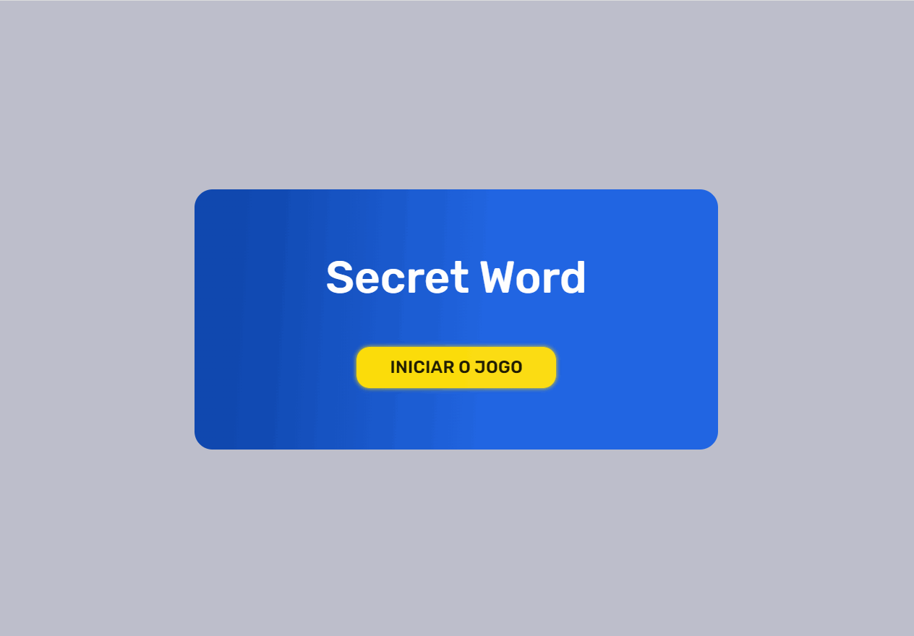
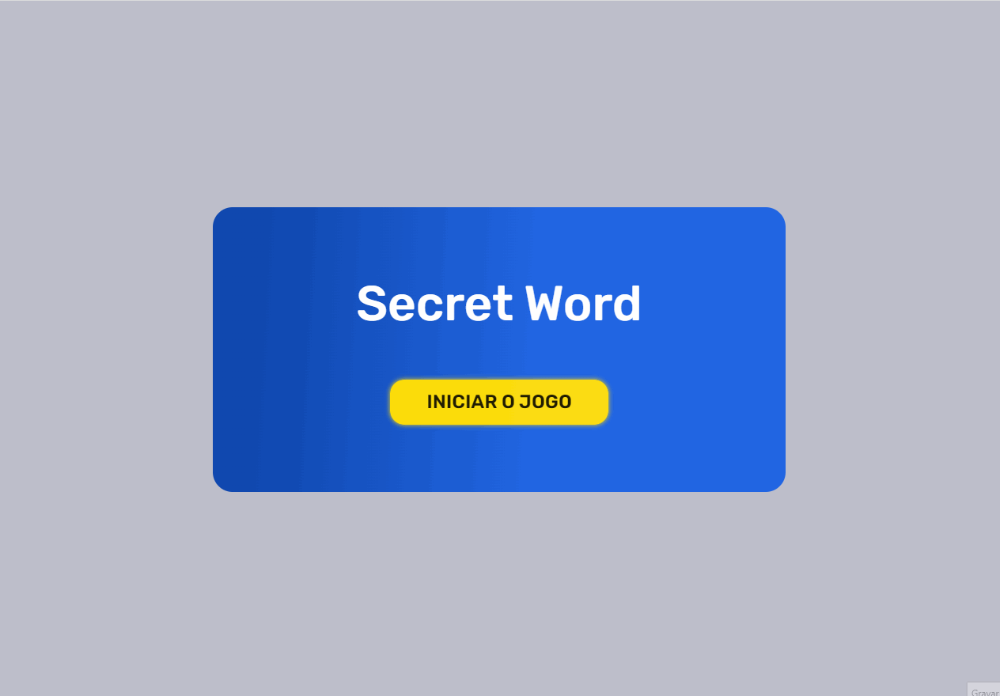

<h1 align="center"> Secret Word </h1>

Esse é um projeto prático feito com React JS, utilizando o Framer Motion para algumas animações do game.

  <a href="#-tecnologias">Tecnologias</a>&nbsp;&nbsp;&nbsp;|&nbsp;&nbsp;&nbsp;
  <a href="#-projeto">Projeto</a>&nbsp;&nbsp;&nbsp;

 

  

  

## 💻 Projeto

Secret Word é um mini jogo que a partir de um tema aleatório, o jogador deverá tentar acertar todas as letras da palavra contendo 10 tentativas!

## 🚀 Tecnologias

Esse projeto foi desenvolvido com as seguintes tecnologias:

- [React](https://reactjs.org/) ( Hooks, Props, States )
- [Sass](https://sass-lang.com/)
- [Node e NPM](https://nodejs.org/)
- [Vite](https://vitejs.dev/)
- [Framer Motion](https://www.framer.com/motion/)
- [Figma](https://www.figma.com/)

## 📱 Mobile

  

## 🖥️ Figma

  

---

Feito com ♥ by Wallace Bezerra

  

